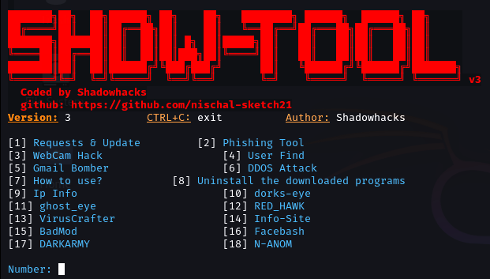

Author : nischal-sketch21
### Version 3

# Hacking Tools
This Tools help you with ethical hacking, Social media hack, phone info, Gmail attack, phone number attack, user discovery, Anonymous-sms, Webcam Hack, Powerful DDOS attack tool.

# Operating System Requirements
Works on any of the following operating systems:

• Android (Using the Termux App)

• Kali-Linux (Debian Based Systems)

# How to Install
* Open the terminal and type `<pkg install git>`
* Then`<git clone https://github.com/nischal-sketch21/Shdwhack.git>`
* `<cd Shdwhack>`
* `<bash Shdwhack.sh>`

# Warning

We are not responsible for any misuse or damage caused by this program. Use this tool at your own risk!

❤️ Support me:
